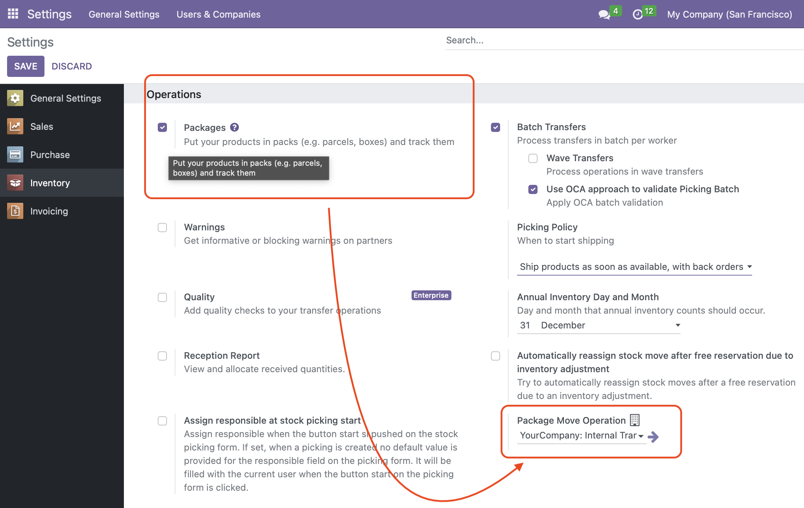

- Go to the "Inventory -> Configuration -> Settings"
- Activate the "Packages" checkbox
- In the "Package Move Operation" select the operation type that will be used for the easy package transfers. Make sure that the "Move Entire Packages" checkbox is enabled. This setting is configured for each company separately.

